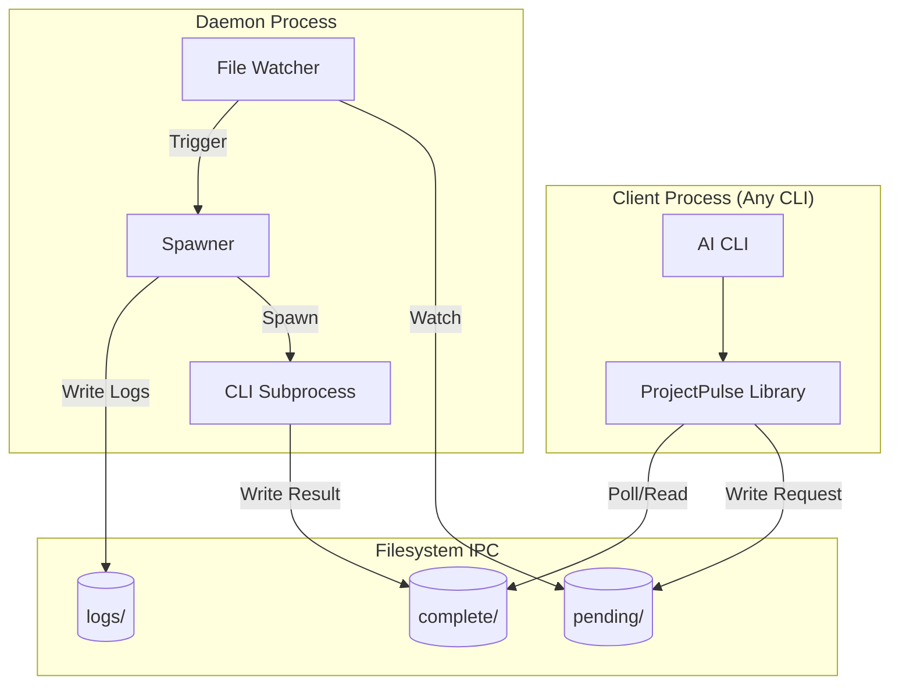
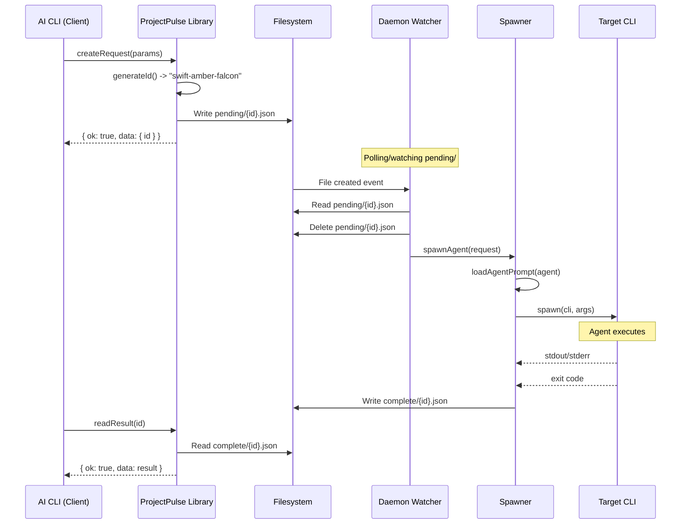
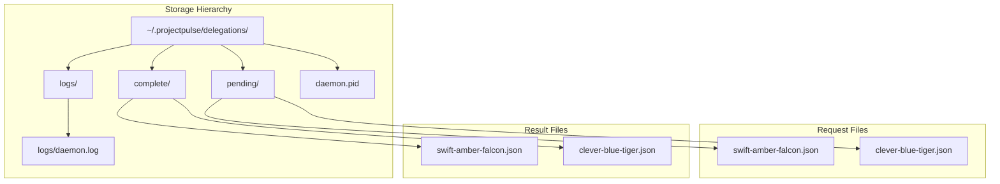

# Architecture

This document describes the architecture and design decisions behind ProjectPulse.

## Table of Contents

- [System Overview](#system-overview)
- [Architecture Diagrams](#architecture-diagrams)
- [Component Details](#component-details)
- [Design Decisions](#design-decisions)
- [Security Considerations](#security-considerations)
- [Performance Characteristics](#performance-characteristics)

---

## System Overview

ProjectPulse is a **CLI-agnostic delegation system** that enables asynchronous background agent execution across different AI CLIs using filesystem-based IPC (Inter-Process Communication).

### Key Principles

1. **Simplicity**: Filesystem is the message bus (no databases, no message queues)
2. **CLI-Agnostic**: Works with any AI CLI without tight coupling
3. **Async by Default**: All delegations run in background via daemon
4. **Single Responsibility**: Each component has one clear job
5. **Fail Safe**: Errors are captured and reported, never silently dropped

---

## Architecture Diagrams

### High-Level Architecture



### Delegation Lifecycle Flow



### Component Dependency Graph

```mermaid
graph LR
    subgraph "lib/delegation"
        types[types.ts]
        id[id.ts]
        storage[storage.ts]
        agent[agent-loader.ts]
        index[index.ts]
    end
    
    subgraph "daemon"
        watcher[watcher.ts]
        spawner[spawner.ts]
        daemon[index.ts]
    end
    
    subgraph "commands"
        delegate[delegate.ts]
        read[delegation-read.ts]
        list[delegation-list.ts]
        cmd_index[index.ts]
    end
    
    storage --> types
    storage --> id
    agent --> types
    index --> storage
    index --> agent
    index --> id
    index --> types
    
    watcher --> storage
    spawner --> agent
    spawner --> types
    daemon --> watcher
    daemon --> spawner
    daemon --> storage
    
    delegate --> storage
    read --> storage
    list --> storage
    cmd_index --> delegate
    cmd_index --> read
    cmd_index --> list
```

### Directory Structure



---

## Component Details

### 1. Delegation Library (`lib/delegation`)

**Purpose**: Core library for creating and managing delegation requests.

**Exports**:
- **Types**: Type definitions and constants
- **ID Generation**: Readable 3-word IDs
- **Storage**: CRUD operations for requests/results
- **Agent Loading**: Load agent prompts from files

**Key Files**:

| File | Purpose | Key Functions |
|------|---------|---------------|
| `types.ts` | Type definitions | `DelegationRequest`, `DelegationResult`, `DelegationEnvelope` |
| `id.ts` | ID generation | `generateId()`, `generateUniqueId()`, `isValidId()` |
| `storage.ts` | Filesystem ops | `createRequest()`, `readResult()`, `listPending()` |
| `agent-loader.ts` | Agent loading | `loadAgent()`, `getAvailableAgentTypes()` |
| `index.ts` | Public API | All exports |

**Design Patterns**:
- **Envelope Pattern**: All functions return `{ ok: boolean, data?, error? }`
- **Async/Await**: All I/O is async with promises
- **Path Resolution**: Always resolve paths to absolute
- **Error Wrapping**: All errors caught and wrapped in envelope

---

### 2. Daemon (`daemon`)

**Purpose**: Background service that watches for requests and spawns CLI subprocesses.

**Components**:

| Component | Purpose | Key Functions |
|-----------|---------|---------------|
| `watcher.ts` | File system monitoring | `startWatching()`, `startPolling()` |
| `spawner.ts` | CLI subprocess management | `spawnAgent()`, `loadAgentPrompt()` |
| `index.ts` | Daemon lifecycle | `startDaemon()`, `stopDaemon()`, `isRunning()` |

**Daemon Lifecycle**:
1. **Start**: Check if already running → Write PID → Start watcher
2. **Run**: Watch pending/ → Spawn agents → Write results
3. **Stop**: Receive SIGTERM → Finish active delegation → Clean up → Exit

**Graceful Shutdown**:
```typescript
process.on('SIGTERM', async () => {
  // 1. Stop accepting new requests
  watcher.stop();
  
  // 2. Wait for active delegation (up to 30 seconds)
  await waitForActiveDelegation(30000);
  
  // 3. Cleanup
  await removePid();
  
  // 4. Exit
  process.exit(0);
});
```

---

### 3. Commands (`commands`)

**Purpose**: CLI command implementations that integrate with main ProjectPulse CLI.

**Commands**:

| Command | Purpose | Key Functions |
|---------|---------|---------------|
| `delegate.ts` | Create delegation | `delegate(prompt, options)` |
| `delegation-read.ts` | Read result | `delegationRead(id, options)` |
| `delegation-list.ts` | List delegations | `delegationList(options)` |

**CLI Integration**: These commands are used by the main CLI (`pulse` command).

---

## Design Decisions

### Why Filesystem IPC?

**Alternatives Considered**:
- **Message Queue** (RabbitMQ, Redis): Requires separate service, complex setup
- **HTTP API**: Requires daemon to run web server, port conflicts
- **Database** (SQLite): Adds dependency, schema management overhead
- **Unix Sockets**: Platform-specific, doesn't work on Windows

**Filesystem Chosen Because**:
- ✅ No external dependencies
- ✅ Works on all platforms (Linux, macOS, Windows)
- ✅ Human-readable (JSON files)
- ✅ Easy to debug (inspect files directly)
- ✅ Natural persistence (files survive crashes)
- ✅ Simple backup/restore (copy directory)

**Tradeoffs**:
- ❌ Slower than in-memory queues
- ❌ Not suitable for high-frequency (1000+ req/sec)
- ❌ Potential file locking issues on network drives

---

### Why Readable IDs?

**Format**: `{adjective}-{color}-{animal}` (e.g., "swift-amber-falcon")

**Alternatives**:
- **UUID**: `550e8400-e29b-41d4-a716-446655440000` (hard to remember/type)
- **Sequential**: `1`, `2`, `3` (collision risk, predictable)
- **Timestamp**: `20260128050000` (not memorable)

**Benefits**:
- ✅ Human-readable and memorable
- ✅ Easy to type and communicate
- ✅ Sortable (alphabetically)
- ✅ Collision-resistant (107,520 combinations)

**Implementation**:
```typescript
const ADJECTIVES = ['swift', 'clever', 'brave', ...]; // 40 options
const COLORS = ['amber', 'blue', 'crimson', ...];     // 48 options
const ANIMALS = ['falcon', 'tiger', 'dragon', ...];   // 56 options

// Total combinations: 40 * 48 * 56 = 107,520
```

---

### Why One Delegation at a Time?

**Current Behavior**: Daemon processes delegations sequentially.

**Alternatives**:
- **Parallel Processing**: Spawn multiple CLI instances simultaneously
- **Worker Pool**: Fixed number of concurrent workers

**Sequential Processing Chosen Because**:
- ✅ Prevents resource contention (CPU, memory)
- ✅ Predictable behavior (no race conditions)
- ✅ Simple implementation (no job queue)
- ✅ Easier debugging (clear execution order)

**When This is Limiting**:
- High-frequency workloads (10+ delegations/minute)
- Many quick delegations queuing behind slow one

**Solution**: Run multiple daemon instances with separate directories.

---

### Why File Watcher with Polling Fallback?

**Primary**: File system watcher (fs.watch)  
**Fallback**: Polling every 5 seconds

**Rationale**:
- File watchers are efficient but can fail on network drives, Docker volumes
- Polling is reliable but slower
- Automatic fallback ensures system always works

**Fallback Trigger**:
```typescript
watcher.on('error', (err) => {
  log('File watcher error, falling back to polling');
  watcher.close();
  startPolling();
});
```

---

### Why Envelope Pattern?

**All functions return**:
```typescript
interface DelegationEnvelope<T> {
  ok: boolean;      // Success flag
  tool: 'delegation'; // Constant identifier
  data?: T;         // Response data if ok=true
  error?: string;   // Error message if ok=false
  code?: number;    // Error code if ok=false
}
```

**Benefits**:
- ✅ Consistent error handling across all functions
- ✅ No thrown exceptions to catch
- ✅ Type-safe with TypeScript
- ✅ Easy to chain operations
- ✅ Clear success/failure distinction

**Usage**:
```typescript
const result = await createRequest(params);
if (!result.ok) {
  console.error(result.error);
  return;
}
console.log(`Created: ${result.data.id}`);
```

---

## Security Considerations

### 1. Working Directory Validation

**Threat**: Malicious request could execute agent in sensitive directory.

**Mitigation**:
```typescript
function validateWorkingDir(dir: string): string {
  const absPath = path.resolve(dir);
  
  // Must exist
  if (!fs.existsSync(absPath)) {
    throw new Error('Directory does not exist');
  }
  
  // Must be directory
  if (!fs.statSync(absPath).isDirectory()) {
    throw new Error('Not a directory');
  }
  
  // Blacklist system directories
  const sensitive = ['/root', '/etc', '/sys', '/proc', '/dev'];
  if (sensitive.some(s => absPath.startsWith(s))) {
    throw new Error('Restricted directory');
  }
  
  return absPath;
}
```

---

### 2. Agent Type Validation

**Threat**: Invalid agent type could cause arbitrary file read.

**Mitigation**:
```typescript
const AGENT_FILES = {
  explorer: 'ExplorationAgent.md',
  reviewer: 'CodingAgenticReviewer.md',
  performance: 'AutonomousPerformance.md',
  architect: 'System_Prompt_Autonomous_Architect.md',
  planner: 'PlanningAgent.md',
};

function loadAgentPrompt(agent: AgentType): string {
  if (!AGENT_FILES[agent]) {
    throw new Error(`Invalid agent: ${agent}`);
  }
  // Safe: agent type is validated before file path construction
  return fs.readFileSync(`agentprompts/${AGENT_FILES[agent]}`);
}
```

---

### 3. Command Injection Prevention

**Threat**: Malicious prompt could inject shell commands.

**Mitigation**:
- Use `spawn()` with array arguments (not shell)
- Never use `exec()` or `shell: true`
- All arguments are properly escaped

```typescript
// SAFE: Arguments are separate, not interpolated into shell command
const proc = spawn('opencode', [
  '--system-file', agentFile,
  '--prompt', request.prompt  // Even if contains '; rm -rf /', it's just an argument
], {
  shell: false  // Critical: no shell interpretation
});
```

---

### 4. File Permissions

**Recommendations**:
```bash
# Delegations directory
chmod 700 ~/.projectpulse/delegations/

# Request/result files
chmod 600 ~/.projectpulse/delegations/**/*.json

# Daemon PID
chmod 600 ~/.projectpulse/delegations/daemon.pid
```

---

## Performance Characteristics

### Latency

| Operation | Typical Latency | Factors |
|-----------|----------------|---------|
| Create request | 5-10ms | Disk write speed |
| Daemon pickup | 100-1000ms | File watcher latency |
| CLI spawn | 100-500ms | CLI startup time |
| Agent execution | 10-300s | Task complexity |
| Result write | 5-10ms | Disk write speed |
| Read result | 1-5ms | Disk read speed |

**Total End-to-End**: 10s - 5min (varies by task)

---

### Throughput

**Sequential Processing**: 1 delegation at a time

**Maximum Throughput**:
- Quick tasks (10s each): ~360/hour, ~8640/day
- Medium tasks (60s each): ~60/hour, ~1440/day
- Long tasks (5min each): ~12/hour, ~288/day

**Scaling Strategy**:
- **Vertical**: Run multiple daemon instances
- **Horizontal**: Distribute across multiple machines

---

### Resource Usage

| Resource | Daemon (Idle) | Daemon + CLI | Notes |
|----------|---------------|--------------|-------|
| CPU | < 1% | 50-100% | CLI agent is CPU-intensive |
| Memory | ~50MB | 200MB - 2GB | Varies by CLI and task |
| Disk I/O | Minimal | Low-Medium | Read agent, write result |
| Network | None | Varies | If CLI accesses network |

---

### Scalability Limits

**Current Design**:
- Single daemon: ~10-100 delegations/hour
- Multiple daemons: 100-1000 delegations/hour
- Filesystem: 10,000+ result files (cleanup required)

**Bottlenecks**:
1. **Sequential processing**: One delegation at a time per daemon
2. **File watcher**: May lag on network drives
3. **Disk space**: Results accumulate over time

**Mitigation**:
1. Run multiple daemons with separate directories
2. Use local SSD for delegation directory
3. Implement automatic cleanup (delete results older than N days)

---

## Future Enhancements

### Potential Improvements

1. **Parallel Processing**: Add worker pool for concurrent delegations
2. **Result Streaming**: Stream partial results as agent produces output
3. **Retry Logic**: Automatically retry failed delegations
4. **Priority Queue**: High-priority delegations processed first
5. **Distributed Mode**: Multiple daemons sharing work via database
6. **Web Dashboard**: Monitor delegations in real-time
7. **Metrics**: Prometheus metrics for observability

### Backward Compatibility

**Commitment**: Any future changes will maintain backward compatibility with:
- File formats (request/result JSON schema)
- Public API (all exported functions)
- Directory structure (pending/, complete/, logs/)

---

## See Also

- [API Reference](README.md) - Public API documentation
- [Configuration Guide](CONFIGURATION.md) - All configuration options
- [Delegation Lifecycle](DELEGATION_LIFECYCLE.md) - State machine details
- [Troubleshooting](TROUBLESHOOTING.md) - Common issues and solutions
